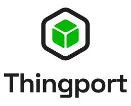

<div align="center">



<h3>Your personal 3D model library.</h3>

<p>
Collect, organize, preview, and manage your 3D printing models<br>
from the places where you discover them.
</p>

<p>
  <a href="https://github.com/TautvydasDerzinskas/Thingport/actions">
    
  </a>
  
  
  
  
</p>

</div>

## About

If you do 3D printing, you probably discover models across **MakerWorld, Printables, Thingiverse, and other 3D model platforms**.

Over time, those bookmarks, downloads, ZIP files, and random folders become a mess.

**Thingport is your personal, self-hosted 3D model library.**

Bring your models together in one place, keep them organized, and preview them directly in your browser.

Instead of having your collection scattered across different websites and your filesystem, Thingport gives you a single place to manage the models you actually want to keep.

## Features

- 🗂️ **Personal model library** — keep your 3D models in one organized place
- 🌐 **Import from model websites** — bring models into your library from supported platforms
- 🔎 **Search & organize** — find models in your collection quickly
- 🧊 **3D previews** — inspect models directly in the browser
- 📦 **Archive your models** — keep local copies of the models you want to preserve
- 🖼️ **Model metadata & previews** — keep useful information together with the files
- 🔗 **Source links** — retain the original model source
- 🐳 **Self-hosted** — run your own instance and keep your collection under your control
- 🌍 **Multi-language ready** — internationalization support built into the frontend
- ⚡ **Modern web interface** — React + Three.js powered UI

## Screenshots

<!-- Screenshots will be added here -->

## Installation

### Docker

Clone the repository:

```bash
git clone https://github.com/TautvydasDerzinskas/Thingport.git
cd Thingport
cp .env.example .env
```

Configure `.env` if needed, then start Thingport:

```bash
docker compose up -d
```

The application will be available at:

```text
http://localhost
```

For a deployment using the published container images:

```bash
docker compose -f docker-compose.deploy.yml up -d
```

## Components

| Component | Description |
|-----------|-------------|
| `frontend` | React web application with Three.js 3D viewer |
| `backend` | Node.js / Express API |
| `db` | PostgreSQL database |
| `flaresolverr` | Web request / anti-bot handling |

## Tech Stack

- **Frontend:** React, TypeScript, Vite, Material UI, Three.js
- **Backend:** Node.js, TypeScript, Express, Prisma
- **Database:** PostgreSQL
- **3D rendering:** Three.js / OpenCTM
- **Deployment:** Docker Compose
- **Testing:** Vitest
- **Linting:** Oxlint

## License

See [LICENSE](LICENSE) for license information.